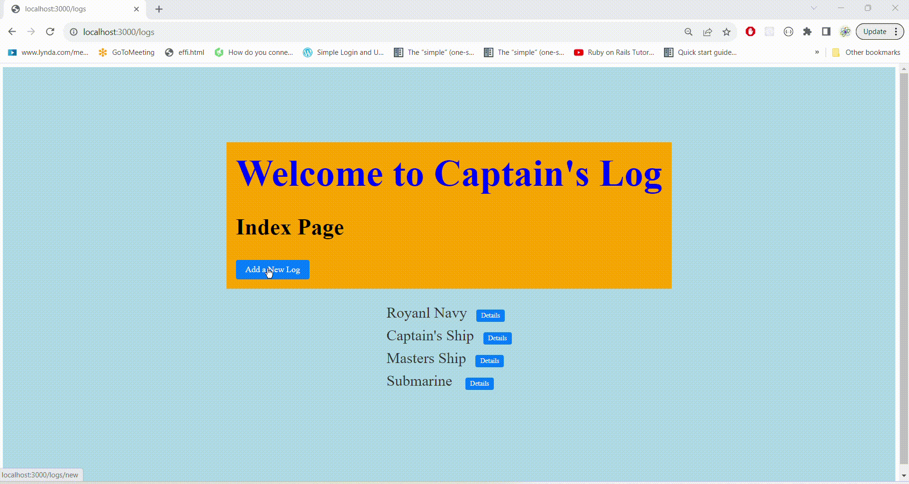

<h1> Captain's LOG Express App </h1>
<h2>Learning Objectives</h2>
Full CRUD app with a mongo database
<h2>Prerequisites</h2>
<ul>
  <li>
    JavaScript
  </li>
  <li>
    Express / Node
  </li>
  <li>
    Mongo / Mongoose
  </li>
</ul>

<h2>Discription</h2>
  

Every great captain, whether on the waters or in the skies, keeps a daily log.

Let's build the perfect Captain's Log App for our extraordinary captains.

There are many ways to get started building an app. This lab follows a specific order for two reasons:

to align with the content of lecture
to give you an order to guide you to create small bits of functionality and test each one before moving on to the next part

